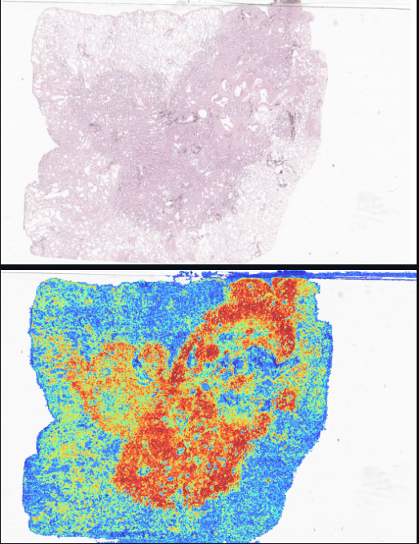
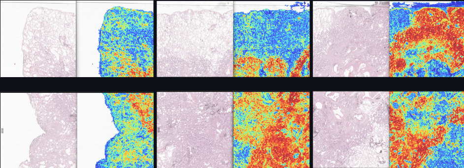

# Project Flow 

*많은 TUMOR DATA, NORMAL DATA가 존재하는데 해당 DATA가 종양인가를 판별하고, 종양이라면 ALK+인가 ALK-를 판별하는 프로젝트*

## <span style="color : white;">CLAM INPUT DATA </span>
 - CLAM Data : SVS file

 - CLAM GITHUB : [CLAM](https://github.com/mahmoodlab/CLAM)
 - CLAM 설치시 관련 에러 및 설치방법 : [CLAM INSTALLATION 정리](https://www.notion.so/CLAM-2023-6-19-2697424e02e04f91a3f27c21c0ecf591?pvs=4)

---
<p align='center'>
<h2>SVS RAW DATA ZOOM</h2>
</p>

<p align="center">
  
</p>


## CLAM OUTPUT
<p align="center">
  
  
</p> 

---


## Our OUTPUT


# 
## Pre-requisites 
- ###  DATA : SVS File, CLAM을 돌린 JPEG 파일 
--- 

## <span style="color : white;">CLASSIFICATION INPUT DATA </span>


### Patch : 
    - SVS File 과 CLAM 결과물에서 Red 비율이 높은 부분을 Matching해서 추출

    - * 위에서 뽑힌 Patch 이름에 width, height가 저장되어 있음 | ex) patch1_#312_441.png 
    - * 추가적으로 LUAC의 Dataset 특성상 이 파일에 대한 경로는 따로 바뀌어야 할 수 있음
         ∵ Dataset을 수동으로 Crop해야해서 하나의 LUAC SVS FILE에서 여러장의 ALK+,ALK- Dataset이 나올 수 있기 때문에
    * Patch 경로는 다음과 같음
        + PATCH
                + LUAC
                     + LUAC_1-1_
                        LUAC_1-1_#width_height.png....
                     + LUAC_2-1_
                        LUAC_2-1_#width_height.png....
                     + LUAC_3-1_
                     + LUAC_4-1_
                     + LUAC_5-1_
                     + LUAC_6-1_
                     + LUAC_7-1_
                     + LUAC_8-1_
                     + LUAC_9-1_
                     + LUAC_10-1_
                     + LUAC_11-1_
                     + LUAC_12-1_
                     + LUAC_13-1_
                     + LUAC_14-1_

                + SSSF
                     + SF17-0084
                     + SS17-7764
                     + SS18-1987
                     + SS22-2650
                     + SS22-6559

                + TCGA
                     + TCGA-50a_
                     + TCGA-50b_
                     + TCGA_67aD
                     + TCGA_67aT
                     + TCGA-67b_
                     + TCGA-67c_
                     + TCGA-78a_
                     + TCGA-78b_
                     + TCGA-78c_
                     + TCGA-86a_

                + YS

                     + YS12-1606
                     + YS15-1117
                     + YS16-2177
                     + YS17-2284
                     + YS18-3319
                     + YS19-0568
                     + YS19-0946
                     + YS19-2439
                     + YS20-0561
                     + YS20-2317


## PYTHON CODE 설명 
    - makePatch.py :
        [LUAC, SSSF, TCGA, YS] 해당 4개의 Tumor에 대해서 Data를 Sampling 
        SVS File 과 CLAM 결과물 JPEG Ratio 가 16:16인 데이터셋에 대해서만 Sampling 
        
        


---
    - dataset.py :
        - Define TumorDataset Class 
        - 이후에 makeDataset.py 에서 Train,Test 각각의 Dataset 생성 
        - 해당 Dataset을 DataLoader의 argument로 전달 

---
    - train.py :
        - Json, TXT File Path 의 Dataset을 기반으로  Training 시작
        - BCEWithLogitLoss로 Class Imbalance 의 최적 Loss를 찾음
          - Code 내에서 데이터의 비율을 10:1, 5:1, 3:1 로 줄여나가면서 해당 Weight를 계산
          - 해당 Model은 Default로 [1,1] ~ [1.6,1] 까지 0.1씩 늘려가면서 실행
        - Epoch, Batch_size, Save_path 등은 argparse를 통해서 설정
        


--- 


## Storage Patch Folder 
+ ### ImageTxtFile
        
    + negative_test.txt

    + negative_train.txt

    + positive_test.txt

    + positive_train.txt 

+ ###  ImageTxt.py, tumorAnnotation.json을 통해서 생성 (LUAC Data에 대해서는 Crop후 추가적으로 데이터 Extraction 할 예정)

+ <span style="color : blue;"> 각각의 TXT파일에는 Train Image Patch, Test Image Patch 를 저장함 </span>    
  
* 추가적으로 데이터를 추가는 tumorAnnotation.json 에 추가 후 데이터셋 생성 
  #


  
## Source Code 

## Train

```
python main.py --learning_rate --batch_size --epochs --batch_size --model_save_path --pretrained


args : 
    Training 시 argument (3090 EA 2 기준)
    - batch_size : 80000
    - epochs : 50
```

  #
## Sigmoid Result 
```c
python main.py  --pretrained=True 

```


## 코드 실행 순서 
```
1. CLAM 을 통한 SVS FILE HEATMAP 생성

2 . CLAM_DATASET(클램결과), DATASET(SVS파일)경로를 MAPPING 되도록 위치

3. MakePatch.py를 수행
    3.1 이 때, Patch를 뽑고싶은 기준 Pixel 값은 개인적으로 수정

4. ImageTxtFile/ImageTxt.py를 실행하여 Train경로를 저장한 Txt파일 생성 
    4.1 MakeDataset.py를 통해서 Dataset을 생성
    4.2 main.py 를 통해 Training | Testing | SigmoidScoreMap 코드 수행 

```


---
  # 
## 해야 할 내용들 정리 해놓음 
```
1. LUAC Dataset에 대한 추가적인 정보가 들어온다면, 그에 맞게 데이터셋을 생성하고, 재훈련

2. Model에서 최적의 Paramter를 찾도록 모델을 훈련
    -> 현재 BCELoss내에서 Pos Weight를 변형해가면서 코드를 수행중 
    -> 이후에 learning rate도 바꿔보면서 훈련해볼 예정(Local Optimal 에 빠지는거 같은 느낌)
    
3. 현재는 ResNet-18 Model을 사용중이지만, Dataset이 충분히 많으니, Layer가 조금 더 깊은 Model들을 사용해도 좋을 거같음
    -> Dataset이 많긴하지만, Sampling에서 Noise가 많았기 때문에 이게 걱정이긴 함 
```


---

  #
## 주의 할 점
```
- 개인 PC RAM 16GB / RTX 3060 1EA 기준 CLAM HeatMap 실행 시, OOM(Out of Memory) Error로 하나의 SVS File씩 돌아가서 반복적으로 csv파일을 지워나가면서 수행해야 했습니다.
- 서버 RTX3090 2EA / RAM 128GB 에서는 충분히 돌아갔으니 이점 유의해서 돌리면 될 거 같습니다.(

지금 작성하고 있는 README.md파일(내 작업폴더 기준으로)은 현재 프로젝트 어디까지 진행되었는지, 어떻게 진행할 예정인지에 대해서 적어놨기 때문에 수정해도 
좋으나 표시나 사전에 말해주세요.
```
